# Laser alignment investigation

```python
# Necessary packages for this notebook
import pathlib

import matplotlib.pyplot as plt
import numpy as np
from witec.spe import SPE
import scienceplots

import pyAvantes  # Custom GitHub library

def view_spectrum(ax, data1, data2, param_dict):
    """A wrapper to apply common formatting options to all plots"""
    ax.set_title("Laser line spectrum")
    ax.set_xlabel("Wavelength (nm)")
    ax.set_ylabel("Intensity")
    ax.plot(data1, data2, **param_dict)
    ax.legend()
    return ax
    
# Location of reference data directory, relative to this document
data_directory = pathlib.Path("../../data")
target_directory = pathlib.Path(__name__).parent / "media"
```

## Problem

Spectra obtained in the WITec confocal microscope contain an unexpected
fluorescence near the laser line of the Verdi V-5 laser (532 nm). These
spectral features are affecting any meaningful ability to perform
photoluminescence studies on various substrates. The fluorescence appears on
a variety of substrates.

See the following example spectrum below, which was obtained by focusing the
laser from the fiber assembly onto a suspended glass cover slip and measuring
the reflected laser light through a 532 nm long pass filter.

```python
source = data_directory / "substrate-tests" / "substrate-tests_cover-slip.spe"
target = target_directory / source.name
winspec = SPE(source)

with plt.style.context(["default", "science", "notebook"]):
    fig, ax = plt.subplots()
    view_spectrum(ax, winspec.axis, winspec.data[0], {"label":"Glass cover slip"})
    figname = target.with_suffix(".svg")
    fig.savefig(figname)
    print(f"Figure saved to {figname}")
    plt.show()
```

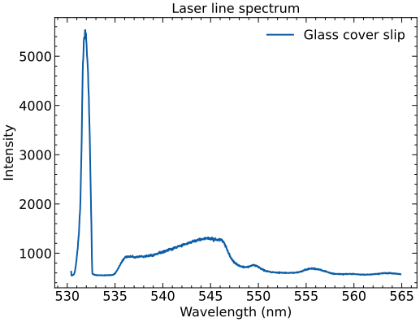

The image shows that there is unexpected fluorescence at wavelengths beyond
532 nm. It is believed that the spectral features are solely from the laser
reflection and not fluorescence from the glass slide because this spectrum is
nearly identical in feature set to those from a bare silicon substrate.
Moreover, the glass cover slide is suspended several centimeters above the
nearest interacting surface to ensure that the collected light is primarily
from the reflection at the glass surface and not from an interaction below the
glass.


## Investigation

It is unknown if these spectral features are part of a messy laser line or if
the fluorescence is coming from anywhere along the optic path from the laser to
the spectrometer.

The primary investigation looks first at the laser light directly from the Verdi V-5.

### Details

The Verdi V-5 laser is set to its lowest power (0.01 W) and passed through
various ND filters before going into a fiber directly to an Avantes
spectrometer.

The Avantes spectrometer contains an SMA fiber input port and an accompanying
multi-mode fiber. The fiber is mounted to a fiber coupler lens and placed by
hand directly in the beam path of the Verdi V-5 laser. Thorlas 1-inch diameter
ND filters (ND10A, ND20A, ND30A, ND40A, ND50A) attenuate the signal by 1, 2, 3,
4, or 5 orders of magnitude and can be arranged in sequence via threaded
retaining rings. For clarity, one order of magnitude reduction corresponds to
a 10% transmission.

### Investigate laser signal directly

The measurement below shows a representative spectral line profile of the Verdi
V-5 laser as it is loosely coupled to the Avantes fiber port after two ND
filters.

```python
source = data_directory / "laser" / "Verdi-V5_spec_0010mW_f-ND50A_f-ND40A_1000ms_2024-01-24-14-56-00.RAW8"
target = target_directory / source.name
avantes = pyAvantes.Raw8(source)

with plt.style.context(["default", "science", "notebook"]):
    fig, ax = plt.subplots()
    view_spectrum(ax, avantes.wavelength, avantes.scope, {"label":f"{avantes.comment}"})
    ax.set_xlim(520, 570)
    figname = target.with_suffix(".svg")
    fig.savefig(figname)
    print(f"Figure saved to {figname}")
    plt.show()
```

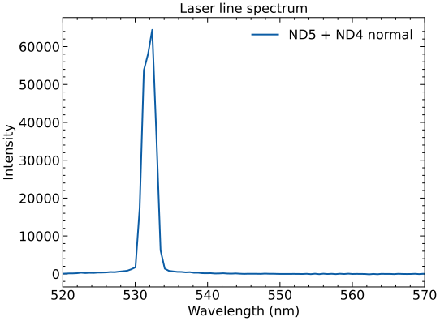

The image shows an expected response from a single mode laser; that is,
a single wavelength with a fairly narrow spectral linewidth.

### Investigate laser signal with better alignment

The measurement above was repeated, but this time the Avantes fiber was moved
gently through the beam spot until more spectral features showed up on the
spectrometer.

```python
source = data_directory / "laser" / "Verdi-V5_spec_0010mW_f-ND50A_f-ND40A_1000ms_2024-01-24-15-05-00.RAW8"
target = target_directory / source.name
avantes = pyAvantes.Raw8(source)

with plt.style.context(["default", "science", "notebook"]):
    fig, ax = plt.subplots()
    view_spectrum(ax, avantes.wavelength, avantes.scope, {"label":f"{avantes.comment}"})
    ax.set_xlim(520, 570)
    figname = target.with_suffix(".svg")
    fig.savefig(figname)
    print(f"Figure saved to {figname}")
    plt.show()
```

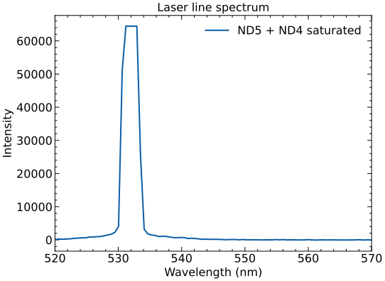

The image show the same response but with a saturated intensity at the expected wavelength of 532 nm.

During collection of the above measurement, I noticed occasional spikes in the
spectrum, accompanied by a much wider spectral line width of the laser.
I couldn't reliably find these positions to record them at this scale, but my
assumption is that they occur when the laser light is maximally coupled into
the Avantes fiber. Furthermore, I worry that the ND filter arrangements that
I am using to protect the Avantes spectrometer from direct laser light exposure
are preventing me from seeing the weak fluorescence signal that pervades my
sensitive photoluminescence measurements.

### Investigate laser signal at higher intensity

I repeated the above measurement, but reduced the total amount of filtering
before collecting the light into the Avantes fiber so that I could see more of
the side band activity accompanying the laser line. Even though I knew the
laser line would appear saturated on the spectrometer, I took care to not
investigate for too long of a time with these reduced protections.

```python
source = data_directory / "laser" / "Verdi-V5_spec_0010mW_f-ND20A_f-ND50A_1000ms_2024-01-24-15-09-00.RAW8" 
target = target_directory / source.name
avantes = pyAvantes.Raw8(source)

with plt.style.context(["default", "science", "notebook"]):
    fig, ax = plt.subplots()
    view_spectrum(ax, avantes.wavelength, avantes.scope, {"label":f"{avantes.comment}"})
    ax.set_xlim(520, 570)
    figname = target.with_suffix(".svg")
    fig.savefig(figname)
    print(f"Figure saved to {figname}")
    plt.show()
```

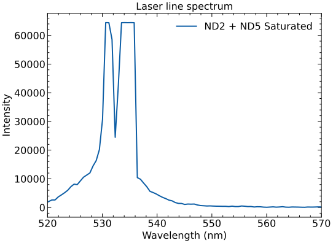

The image above shows a clear evolution of spectral features beyond the
expected single-frequency 532 nm laser line. In particular, there is a clearly
visible second emission line at an undetermined wavelength above 532 nm
(nominally 534 nm). It is evident that these features appear when the signal is
maximally coupled into the Avantes fiber. My working assumption is that maximum
coupling occurs when the fiber core is coaxial with the TEM~00~ mode from the
laser.

### Investigate laser signal with better coupling

To investigate this further, I switched focus to the single-mode fiber I knew
to be well-aligned with the Verdi output that normally runs to the input of the
WITec system. This fiber has a notched FC/PC connector at its end that doesn't
directly mate with the input port where the Avantes multi-mode fiber is
supposed to connect to the spectrometer, but I could carefully hold the
single-mode fiber close to the Avantes input port and still read an appreciable
signal.

To compensate for the loss of coupling efficiency in the mismatch of fibers,
I reduced the ND filter arrangement on the light incident on the single-mode
fiber. I recorded the output spectrum of the Verdi laser again, but the key
difference between this measurement and the previous direct laser measurements
is that the laser goes through a 10x confocal microscope objective and into
a single-mode fiber instead of using the supplied Avantes multi-mode fiber.

```python
source = data_directory / "laser" / "Verdi-V5_spec_0010mW_f-ND40A_1000ms_2024-01-24-15-16-00.RAW8" 
target = target_directory / source.name
avantes = pyAvantes.Raw8(source)

with plt.style.context(["default", "science", "notebook"]):
    fig, ax = plt.subplots()
    view_spectrum(ax, avantes.wavelength, avantes.scope, {"label":f"{avantes.comment}"})
    ax.set_xlim(520, 570)
    figname = target.with_suffix(".svg")
    fig.savefig(figname)
    print(f"Figure saved to {figname}")
    plt.show()
```

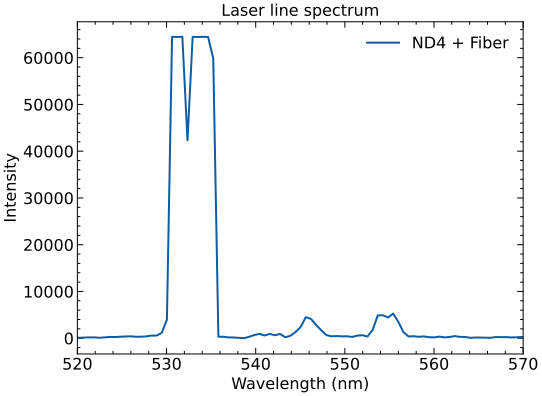

The image above shows clear signs of secondary signals other than the expected
532 nm emission line. It is still unclear if these interactions are introduced
from the coupling lens, are artifacts of a dirty fiber face, are leftover modes
from the Nd:YVO~4~ illumination in the Verdi laser, are improperly filtered
emission lines from the Verdi etalon, or are something else.

Two key results are shown together for visual comparison to highlight the
similarity of this observed secondary signal with the fluorescence observed in
the WITec assembly.

```python
avantes_source = data_directory / "laser" / "Verdi-V5_spec_0010mW_f-ND40A_1000ms_2024-01-24-15-16-00.RAW8" 
avantes = pyAvantes.Raw8(avantes_source)

winspec_source = data_directory / "substrate-tests" / "substrate-tests_cover-slip.spe"
winspec = SPE(winspec_source)
target = target_directory / "fiber_microscope_comparison"

def normalize(array):
    return (array - np.min(array)) / (np.max(array) - np.min(array))

with plt.style.context(["default", "science", "notebook"]):
    fig, ax = plt.subplots()
    view_spectrum(ax, avantes.wavelength, normalize(avantes.scope), {"label":f"{avantes.comment}"})
    view_spectrum(ax, winspec.axis, normalize(winspec.data[0]), {"label":"Glass cover slip"})
    ax.set_xlim(520, 570)
    ax.set_title("Normalized comparison of laser line")
    figname = target.with_suffix(".svg")
    fig.savefig(figname)
    print(f"Figure saved to {figname}")
    plt.show()
```

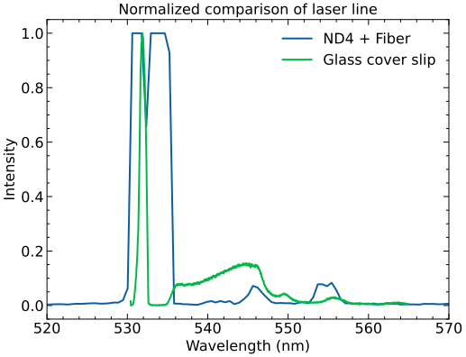

It is clear there's a correlation of the laser signal as measured directly
before the WITec microscope and immediately after the WITec microscope, which
further rules out fluorescence effects from any substrates investigated in the
microscope.

It is still unclear if this is an optics problem (i.e. an issue with the
single-mode fiber or accompanying coupling lens), or if this is an inherent
flaw in the Verdi output. I don't have a fiber scope handy to look for debris
or burn marks at the face of the input fiber, so I turn my attention to
investigating the Verdi output.


### Perform LBO optimization

- Summary of LBO optimization procedure (link section in PDF)
- Put recorded settings in separate log file (link here)

After the LBO temperature optimization, I looked at the output spectra from the
laser through the existing fiber coupler and single-mode fiber. The figure
below shows the spectrum at previous PL conditions (ND1 filter coupled into
single-mode fiber via 10x objective), and the same measurement again but with
an ND4 filter.

```python
single_mode_sources = data_directory.glob("laser/*SMfiber*2024-01-26*")

with plt.style.context(["default", "science", "notebook"]):
    fig, ax = plt.subplots()
    for source in single_mode_sources:
        avantes = pyAvantes.Raw8(source)
        view_spectrum(ax, avantes.wavelength, avantes.scope, {"label":f"{avantes.comment}"})
    ax.set_xlim(500, 650)
    ax.set_title("Indirect laser measurement at various powers")
    figname = target_directory / "indirect_alignment_singlemode.svg"
    fig.savefig(figname)
    print(f"Figure saved to {figname}")
    plt.show()
```

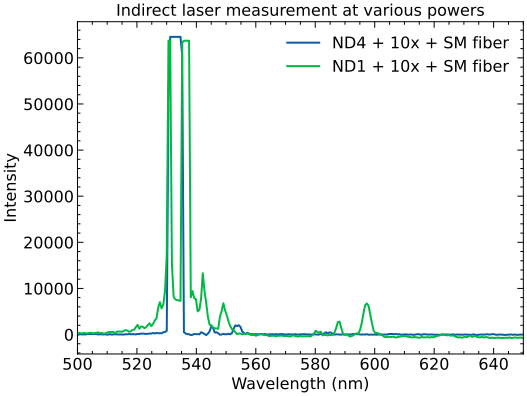

The image above shows no obvious reduction of the secondary spectral features
after the laser line.

For good measure, I investigated the new laser output by couping directly into
the Avantes multimode fiber (bypassing the fiber coupler and single-mode
fiber), just to be sure that the extra signal is not coming from the existing
fiber assembly. The figure below shows the results of this more direct
measurement.

```python
multi_mode_sources = data_directory.glob("laser/*MMfiber*2024-01-26*")

with plt.style.context(["default", "science", "notebook"]):
    fig, ax = plt.subplots()
    for source in multi_mode_sources:
        avantes = pyAvantes.Raw8(source)
        view_spectrum(ax, avantes.wavelength, avantes.scope, {"label":f"{avantes.comment}"})
    ax.set_xlim(500, 650)
    ax.set_title("Direct laser measurement at various alignments")
    figname = target_directory / "direct_alignment_multimode.svg"
    fig.savefig(figname)
    print(f"Figure saved to {figname}")
    plt.show()
```

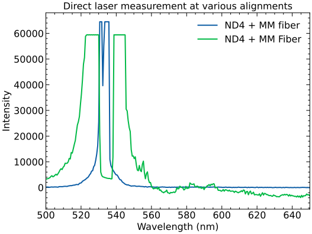

The image above shows mixed results. In some handheld arrangements, the laser
line looks slightly cleaner, but in at least one alignment configuration, there
appears to be more spectral broadening than before.

It is worth noting that in these collection arrangements, only one ND filter
(ND4) was used before the Avantes spectrometer, whereas the initial
investigations above used some combination of two ND filters. It is likely that
the extra ND filters were cutting out this noise before.

My conclusion from the LBO optimization is that the process didn't hurt the
emission in terms of spectral line width, but the source of the spectral
contamination remains unknown.

Not shown or recorded in any of the previous spectra is another spectral
feature slightly below 900 nm. This showed up in rare cases when inserting the
Avantes multi-mode fiber at the Verdi exit port, and is not simultaneously
present when the rest of the noise is visible on the spectrometer.

While both the direct and indirect laser measurements show a broadened laser
line, the results of the above investigations make me believe that the source
of the contamination lies mainly in the Verdi assembly, but that we see these
effects only when we are coaxially aligned.

I turn my attention now to disrupting the coaxial alignment of the single-mode
fiber in an attempt to pick out a sufficiently intense laser line that doesn't
contain all of the superfluous signal that is presumably present along the
immediate optical axis.

### Clean the single mode fiber

I examined both ends of the yellow Thorlabs single-mode fiber that runs from
the Verdi fiber coupler lens assembly to the back of the WITec microscope.

The cores of the fibers appeared undamaged. There was mild debris on the outer
rim of the cladding. Both ends were cleaned with methanol; lens tissue paper
was folded several times and held clamped on one end with hemostats. A few
drops of methanol were dropped on the folded lens tissue and the tissue was
dragged loosely over the tip of the fiber. This was repeated with clean tissue
on the other end.

Both ends were reexamined not to have debris on the cladding anymore.

### Realign the single mode fiber coupler

The purpose of this realignment is to see if I can find a suitable input fiber
arrangement that contains a portion of the TEM~00~ laser line without the
secondary signal that accompanies the spectra above.

The Newport lens assembly consists of a 10x microscope objective positioned on
its side in front of a 5-axis adjustable fiber holder. The objective sits on an
L-shaped holder arm that resembles a Scrabble tile holder. The objective arm
and the fiber holder are connected together, but are each mounted on their own
post. The lens is held by a retaining ring. The objective was removed so that
a complete realignment could ensue.

For all realignment procedures, the laser was on at its lowest power setting
(0.01 W) and appropriate safety glasses were worn whenever the laser was on.

The unaltered beam path was established through the fiber holder with the fiber
removed and marked on the back wall of the laser enclosure box with a laser
illuminating card. The objective was placed on the objective arm as far from
the fiber source as could be tightly secured. This was to ensure the objective
was flat with the arm, as would be the case when it is permanently mounted. The
level of the objective arm was established by observing the expanded beam over
the existing laser mark. The posts were adjusted until the center of the
expanded laser beam was at the initial laser mark. After this adjustment, the
objective could be slid along the objective arm with no noticeable shift in the
position of the center of the expanded beam on the back illumination card.

With the objective level and aligned, the cleaned fiber was inserted back into
the holder. The fiber holder was situated on the center of the unaltered beam
path with no objective yet in place. With the fiber roughly centered, the
objective was placed approximately 10 mm from the end of the tip of the fiber.
There is no room to insert a measuring device to approximate this distance, but
after the final alignment was obtained, the position of the objective is such
that you can see the illuminated fluorescing fiber tip through your safety
goggles when looking from the side. Additionally, the distance from the front
of the objective arm (closest to the Verdi exit) and the tip of the opening of
the objective is approximately the width of 1.5 ND filters when they are
mounted in the provided Thorlabs retaining rings.

Using the thin glass cover slip that was already in focus from previous
investigations, I mounted the other end of the single mode fiber to the back of
the WITec microscope to monitor the reflection of the laser light with the WITec
camera. I could see which adjustments made the beam brighter in real time. Note
that when near focus, there appeared two circular beam spots on the camera that
changed with focusing distance (one from the front surface reflection and
another from the back surface reflection). I made coarse adjustments to the
fiber positioner until the beam became noticeably bright on the camera. Note
that these adjustments involved walking the fiber in and out of focus on the
Newport objective, which in turn changed how the beam propagated out of the
fiber in the back of the WITec microscope, which necessitated adjusting the
fiber micrometer screw to collimate the laser inside the WITec microscope. This
ultimately required a slight readjustment of the z-height of the stage to return
to focus.

When the beam became noticeably bright on camera, I directed the signal of the
reflected laser light back to the spectrometer. For reference, this beam path
goes from glass cover slip, through a 100x Zeiss objective, through a 532 nm
longpass filter, through a multi-mode fiber, onto a spectrometer grating into
a CCD. This also requires coupling the multi-mode fiber to the proper lateral
position at the top of the WITec microscope to pick out the reflected light from
the imaging axis (defined as the path from the exact center of the laser spot to
the fiber core that acts as a pinhole discriminator). This is done by adjusting
a two-axis micrometer stage.

Adjusting the fiber alignment at the Newport fiber coupler affects the path to
back of the WITec microscope, which affects the position of the laser spot on
the glass cover slip, which affects the coupling position of the multi-mode
collection fiber that goes to the spectrometer. Fine adjustments in x and y on
the Newport input fiber alignment don't move the laser spot on the glass cover
slide enough to warrant re-alignment of the collection fiber at the top of the
microscope, but coarse adjustments do. Adjusting the distance or tilt between
the fiber and the Newport coupling objective required tweaking up the fiber
collimation at the WITec entrance port, but also did not warrant changes to the
top collection fiber on every adjustment.

For a small set of adjustments to the input fiber, the output could be monitored
in real time on the spectrometer. After a local maximum signal was obtained
using only x and y adjustments to the input fiber holder, I switched the
microscope configuration back to the WITec camera and adjusted the collimating
micrometer screw in the back of the WITec and refocused the stage so that the
beam spot was minimized. I then went back to monitoring the spectrum and
confirmed through fine adjustments that my existing alignment settings were
still a local maximum.

I then adjusted the focus distance from the Newport input
objective to the fiber holder and repeated this process. When you are near the
optimum focus distance to the input objective, the tolerance between x and
y adjustments is such that you can only make adjustments with the fine axis
controls.

When the appropriate z-distance between the input objective and the fiber
coupler is obtained, I optimized the tilt of the fiber. This is done through set
screws on the z-axis knob in the back of the Newport fiber holder. Each
adjustment of the tilt required a re-optimization of the fine x and y settings,
a minor touch up to the collimating set screw in the back of the WITec,
refocusing of the laser on the glass cover slip, and re-alignment into the
multi-mode collection fiber. These adjustments were minor, but frequent.

I took mental note of the approximate spectral intensity on the spectrometer and
adjusted the tilt of the input fiber in one direction. After the minor tweaks
listed above, I compared the new spectral signal to its approximate value from
before. I mainly concerned myself with the peak intensity of the 532 nm laser
line, even though the accompanying signal also grew with the laser signal.

After iterating semi-systematically through the fiber tilt arrangements,
I arrived at what I deemed a sufficiently maximized laser signal as measured by
the spectrometer.

Part way through my alignment efforts above, I gave up on the prospect of being
able to pick out a strong laser line without any secondary fluorescence signal.
The criteria I set for myself is that I should be able to enhance the laser line
signal as viewed on the spectrometer while finding a fiber arrangement that at
least mitigated the secondary signal. Every such time I enhanced the laser line,
the secondary signal followed in intensity. I instead settled on an input fiber
arrangement that optimized the laser signal irrespective of the strength of the
secondary signal.

```python
coverslips = sorted(data_directory.glob("substrate-tests/*cover-slip*2024-01-31*.SPE"))

with plt.style.context(["default", "science", "notebook"]):
    fig, ax = plt.subplots()
    for source in coverslips[0:1]:
        winspec = SPE(source)
        view_spectrum(ax, winspec.axis, winspec.data[0], {"label": source.stem.split("_")[-1]})
    ax.set_title("Laser emission on glass cover slip")
    figname = (target_directory / source.name).with_suffix(".svg")
    fig.savefig(figname)
    print(f"Figure saved to {figname}")
    plt.show()
```

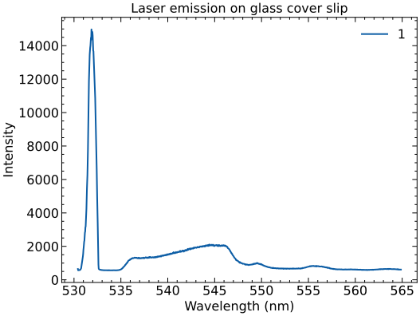

The image above shows a representative laser line spectrum as it appears off
a reflected glass cover slide in a 100x Zeiss objective for a 0.5 s exposure
after my idealized fiber alignment on Jan 31, 2024.

The illustrate the effect of adjusting the multi-mode collection fiber, I made
small changes to the position of the top collection fiber by turning the
micrometer set screws less than a quarter of a turn. The results appear below,
alongside the original measurement above.

```python
coverslips = sorted(data_directory.glob("substrate-tests/*cover-slip*2024-01-31*.SPE"))

with plt.style.context(["default", "science", "notebook"]):
    fig, ax = plt.subplots()
    for source in coverslips[0:2]:
        winspec = SPE(source)
        view_spectrum(ax, winspec.axis, winspec.data[0], {"label": source.stem.split("_")[-1]})
    ax.set_title("Laser emission on glass cover slip")
    figname = (target_directory / source.name).with_suffix(".svg")
    fig.savefig(figname)
    print(f"Figure saved to {figname}")
    plt.show()
```

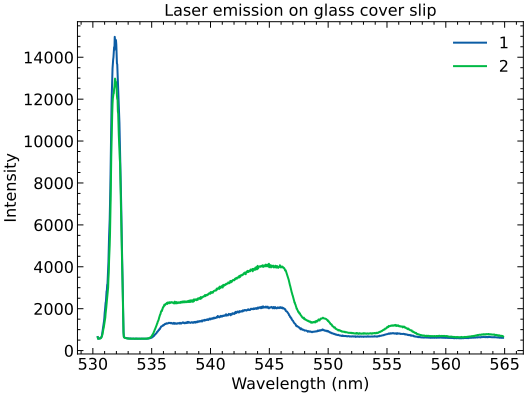

The results above highlight the relatively arbitrary nature of the collection
fiber. I can move this multi-mode core into such a position that the laser
signal is nearly two times larger in magnitude and that simultaneously makes the
secondary unknown fluorescence spectra disappear altogether. This is a known
advantage of confocal microscopy. Picking the appropriate pinhole placement is
crucial in enhancing resolution of a confocal image beyond conventional imaging.

## Laser alignment characterization

### Power characterization

- Link to table of power measurements

Summary of power measurements after previous alignment on Aug 15, 2022

| Set Power (W) | Verdi Shutter (mW) | Fiber Out (mW) | 50x objective (mW) | 100x objective (mW) |
|---------------|--------------------|----------------|--------------------|---------------------|
| 0.01          | 13.45 ± 0.12       | 6.1 ± 0.3      | 2.46 ± 0.12        | 0.84 ± 0.06         |
| 0.02          | 23.1 ± 0.1         | N/A            | N/A                | N/A                 |

After LBO optimization on Jan 26, 2024 and realignment on Jan 31, 2024

| Set Power (W) | Verdi Shutter (mW) | Fiber Out (mW) | 50x objective (mW) | 100x objective (mW) |
|---------------|--------------------|----------------|--------------------|---------------------|
| 0.01          | 14.5 -- 15.1       | 8.8 -- 9.3     | 2.8 -- 3.3         | 0.8 -- 0.9          |
| 0.02          | 24.6 -- 25.1       | 13.97 -- 15.81 | 4.7 -- 5.4         | 1.3 -- 1.5          |
| 0.03          | 34.6 -- 35.6       | 19.8 -- 22.0   | 6.2 -- 7.9         | 1.8 -- 2.1          |
| 0.04          | N/A                | 25.6 -- 28.6   | 8.6 -- 9.8         | 2.4 -- 2.7          |

In total, the raw power at the end of the single mode fiber went from about 6 mW
to nearly 9 mW, or approximately a 40--50% increase in throughput, depending on how
stable the laser wants to be.

With the ND filters in place at the input fiber coupler, the power was ramped up
on the Verdi to determine the power throughput at various objectives and ND
filter arrangements.

- Link to table of power readings

The results of the table indicate that the power is saturating before it reaches
1.0 W set power. The ND filters are rated for a damage threshold that equates to
roughly 2 W given the quoted beam diameter of the Verdi output. I cannot safely
operate at a stable 5 W and cut down the power with an ND filter.

### Pinhole optimization

Having a smaller pinhole (i.e. fiber core) collects less light, but
discriminates more adeptly between the true in-focus signal and nearby
out-of-focus artifacts. The true pinhole placement can be positioned such that
it is optimized for a point-source excitation (i.e. PL signal from a point-like
defect) or point-source illumination (i.e. a laser spot that is known to exist
in a tight radius but whose collection path to the spectrometer collects light
from nearby scattering effects).

For perfect point-source illumination, a pinhole isn't strictly necessary if you
aren't concerned about discriminating between different focusing planes of the
excited mode volume of your substance under investigation. In practice, laser
spot sizes do not illuminate point-like enough when you are looking for quantum
emitters, so a pinhole is advantageous for all applications and necessary when
you want to beat the diffraction limit for visible light in an ordinary optical
microscope.

The choice of proper pinhole placement for a point-like detection mechanism
eludes me. Intuition leads me to believe that the point-like laser and the
point-like defects that generate PL signal should be coaxial. This is to say the
collection fiber pinhole placement that is optimized for reflected laser light
and the placement that is optimized for PL signal should overlap, and that the
only discerning factor between the two signals is attributed to the width of the
pinhole necessary for discriminating the minimum mode-volume of the illuminating
laser or the minimum mode volume of the point defect.

My informal observation is that the laser line is optimized at one pinhole
location and the PL signal is optimized at another. This I attribute to
a non-normal reflection of the laser at the sample. I believe we want the
pinhole of the fiber core situated such that we are optimizing PL signal and not
laser signal.

If the secondary signal from the laser is traveling down the
fiber in a different propagation mode from the laser, then my thinking is that
perhaps the focus point of the laser and the focus point of this secondary
signal will have slightly different convergence points, and thus my previous
multi-mode collection fiber alignments were improperly focusing on this
secondary signal and not the laser signal.

I switched out the glass cover slide for a PL alignment marker from Thorlabs and
focused the laser to a spot on the top surface of the fluorescent acrylic with a 50x objective. I did
this to ensure that I would be focusing on a fluorescence signal emanating from
the mode volume of the focused TEM~00~ mode of the laser. I put an ND2 filter
before the input fiber to reduce the laser intensity and inspected a continuous
live readout of the PL signal. I optimized the multi-mode collection fiber at
the top of the WITec assembly until the signal was maximized on the
spectrometer. The results appear below.

```python
source = data_directory / "substrate-tests" / "substrate-tests_pl-red-align_spec_532nm_0010mW_f-ND20A_obj-50x_1000ms_2024-01-31_1.SPE"
target = target_directory / source.name
winspec = SPE(source)

with plt.style.context(["default", "science", "notebook"]):
    fig, ax = plt.subplots()
    view_spectrum(ax, winspec.axis, winspec.data[0], {"label": "Optimized pinhole for 50x objective"})
    ax.set_title("Laser emission on red PL alignment marker")
    figname = target.with_suffix(".svg")
    fig.savefig(figname)
    print(f"Figure saved to {figname}")
    plt.show()
```

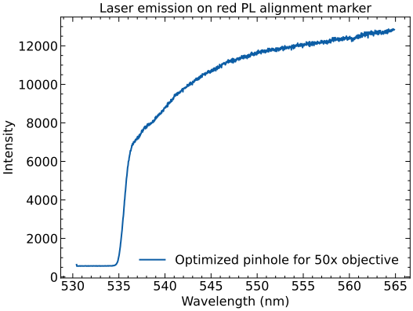

With the optimized pinhole location untouched, I then focused back on the glass
cover slip to compare the new laser line spectra to its previous
characterization and 100x objective. My hope is that this new pinhole position will discriminate
any secondary signal from the laser because that secondary signal is diverging
at a different rate than the laser and thus focused and collected at a different
pinhole position.

```python
coverslips = sorted(data_directory.glob("substrate-tests/*cover-slip*2024-01-31*.SPE"))

with plt.style.context(["default", "science", "notebook"]):
    fig, ax = plt.subplots()
    for source in coverslips[0:3]:
        winspec = SPE(source)
        view_spectrum(ax, winspec.axis, winspec.data[0], {"label": source.stem.split("_")[-1]})
    ax.set_title("Laser emission on glass cover slip")
    figname = (target_directory / source.name).with_suffix(".svg")
    fig.savefig(figname)
    print(f"Figure saved to {figname}")
    plt.show()
```

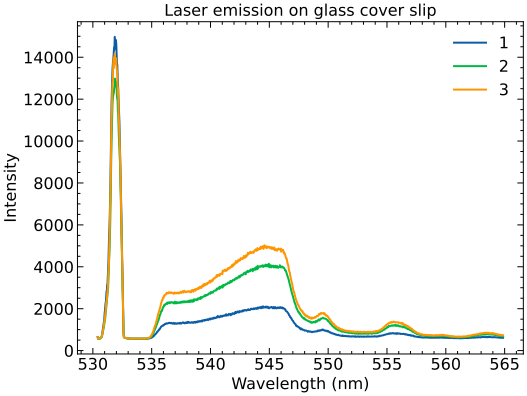

The results above show no reduction in the secondary signal from the reflected
laser line. In fact, the proportion of the secondary signal is enhanced
compared to the relative strength of the displayed laser line at 532 nm. If my
hypothesis about the separate propagation mode of the secondary signal along
the fiber is correct, then the interpretation of the results above suggests
that any slight divergence in the secondary propagation is not appreciably
outside the mode volume of the focused laser spot to be discriminated by the
pinhole of the multi-mode fiber core.

One way to test this hypothesis further is to find a smaller core diameter fiber
that would be more discriminating in the collected mode volume of excitation.
The trade off to this approach is that all PL signal will be reduced.

I would like to confirm this pinhole alignment with a sample that is more
point-like than a red fluorescing acrylic plate before I look for other fibers.

An easier solution to this problem is to purchase a bandpass filter to place
directly in front of the laser to cut out the secondary signal. If the secondary
signal is indeed coming from some internal process in the Verdi pumping
mechanism, then this filter is a first-order solution to our problem. If the
presence of these polluted laser modes is indicative of a failing pump diode,
then the filter is only a band aid for a potentially future costly replacement.
However, if the secondary signal is coming from the fluorescent cladding on the
face of the single-mode fiber, then no amount of laser filtering will fix our
issue.

