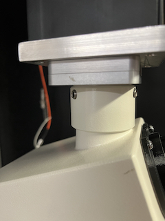
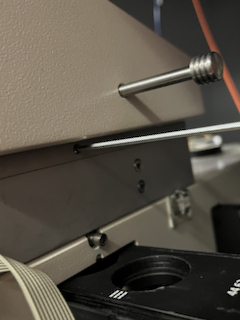
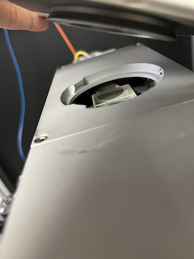
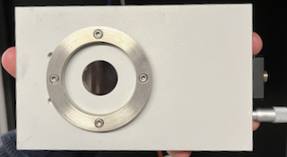
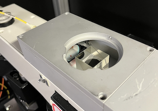
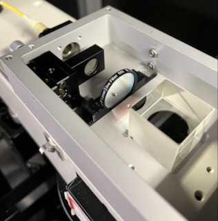

# WITec laser bay

The laser bay in the WITec AlphaSNOM receives a fiber-coupled laser beam and
collimates it onto a beam-splitter, where it enters the infinity-space of an
upright confocal microscope.

The original laser bay from the WITec AlphaSNOM 300 is configured to receive
a filter assembly to apply corrections to the beam path before the laser
reaches the beam splitter. Our model does not come equipped with this optional
configuration.

This guide outlines the modifications we made to the original configuration to
support our own custom filtering.

## Laser line filter

The spectra observed from samples illuminated by the Verdi laser in the WITec
microscope are known to have strong broadband fluorescence near the laser line
(532 nm). This fluorescence impedes our ability to measure meaningful
photoluminescence from the sample. We determined the source of this
fluorescence to originate in the single-mode fiber carrying the 532 nm laser.
It is unclear if this fluorescence is from the fiber cladding or from a defect
within the core of the fiber, but this phenomenon is repeatable for at least
two different single-mode fibers.

Alex Klapowitz 3D printed a plastic holder at the Wondry with dimensions
specified in [`assembly_filter-holder.step`](media/assembly_filter-holder.step)
that holds a laser line filter normal to the beam path.

This filter needs to be updated whenever the laser source is updated.

## Change the filter in the laser bay

The instructions below show you how to access the 3D-printed filter holder.

### 1. Remove top microscope assembly

- Loosen the three locking screws on the top microscope collar and remove the
  top microscope assembly.

### 2. Remove diverter prism

- Remove the camera from the eyepiece above the diverter prism.
- Loosen the set screw below the diverter prism.

- Tilt to lift off the diverter prism and set aside. The prism mates with the
  lower microscope body through an alignment collar fixed to the prism that
  sits inside a grove of the laser bay.

### 3. Open laser assembly

- Remove the screws on the top corners of the laser assembly.

### 4. Reassemble

- Repeat instructions in reverse order for reassembly.
- Realign collection optics at the top of the microscope after reassembly.

