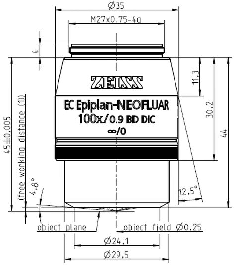

# Microscope objectives

The WITec microscope currently has the following infinity-corrected objectives
configured for use.

| Label                     | Magnification | NA   | Working Distance | Parfocal length | Threading   |
|---------------------------|---------------|------|------------------|-----------------|-------------|
| Nikon LU PLAN FLUOR EPI   | 50x           | 0.80 | 1.0 mm           | 60 mm           | M25         |
| Zeiss EC Epiplan-Neofluar | 100x          | 0.90 | 1.0 mm           | 45 mm           | M27x0.75-40 |

The mismatch in model of lenses used in the same optical setup means that the
magnification inscribed on the lens is not representative of the real
magnification of the image. This is of little concern to us because the
ScanCtrlSpectroscopyPlus software is capable of calibrating the image pixels in
the eyepiece camera to the known displacement of piezoelectric stages under
the objective.

See also: 

- [Magnification in infinity optics][infinity-optics]
- [Infinity optical systems][infinity-systems]

[infinity-optics]: https://evidentscientific.com/en/microscope-resource/tutorials/infinityoptics/magnification
[infinity-systems]: https://www.microscopyu.com/microscopy-basics/infinity-optical-systems

## Existing problem

The objective turret on the WITec microscope accepts M27 threaded objectives,
so the Nikon lenses must be mounted with an adapter collar. The difference in
parfocal length and the presence of the adapter collar in the Nikon lens mean
that rotating between different microscope objectives mandates significant
refocusing on the stage. Furthermore, the difference in height required to
obtain stage focus between objectives is geometrically infeasible when both
lenses are configured in the objective turret because the lengthier Nikon lens
hits the stage when we lower the microscope to focus with the 100x Zeiss
objective.

We have previously avoided this second problem by placing our sample on
a separate elevated mini stage when using the 100x Zeiss objective. This
required us to commit to one objective per investigation, as moving the sample
on or off this mini stage resets our absolute stage coordinates and prevents
repeatable investigations.

## New collar adapter

We have newly solved our second problem above to allow for both objectives to
remain installed with no physical geometric obstruction between focus points.
Our new solution extends the 100x Zeiss objective by a nominal length to put
its effective parfocal length on par with those from Nikon lenses. This
solution eliminates the need to move the sample off or onto a mini stage
when switching objectives.

I deduced the necessary extension distance by recording the difference in stage
coordinates between a focused image under each objective. The exact focus point
in each case was determined as the distance that resulted in the smallest spot
size of the collimated Verdi laser beam on a flat reflective sample.

The stage coordinates in the PIMikroMove software do not appear to be
calibrated to their displayed units in mm. Thus, after recording the difference
in stage coordinates between objectives, I also measured the difference in
stage coordinates between a sample focused on the WITec stage and a sample
focused on the elevated mini stage, whose real distance I could measure
accurately with calipers. After normalizing the stage coordinates to real
units, the real translated distance between objectives was 22.757 mm.

| Objective                 | Collar length |
|---------------------------|---------------|
| Zeiss EC Epiplan-Neofluar | 22.757 mm     |

A representative schematic of the existing Zeiss objective appears below. The
collar was designed to fit between this objective and the stock objective
turret in the WITec microscope with the collar length specified above.

> If replicating this collar in Stevenson 6517, have the machinist confirm
dimensions of the threads before machining.

### Observations and results

After installing the collar adapter on the Zeiss 100x objective, the difference
in optimal focus between the two objectives is within 1 mm. This difference is
attributed to machining tolerances in the brass collar and the degree to which
the collar is tightened into the objective turret.

Although the magnification should not be affected in an infinity-corrected
lens, we re-calibrated the scale on the xy-piezoelectric stage coordinates in
the ScanCtrlSpectroscopyPlus VideoControl module. Look for the scale settings
along the lines `100x 0.9NA with collar`.

As a secondary observation, we note that the center positions of each objective
are not exactly concentric. That is, rotating the objective turret between
lenses results in a laser spot whose focused position is approximately 10 µm
offset from the previous configuration. The direction and magnitude of this
displacement is unique to the specific two turret slots that the objectives are
mounted in. This offset also appears to depend on how tightly each objective is
mounted into the turret.
