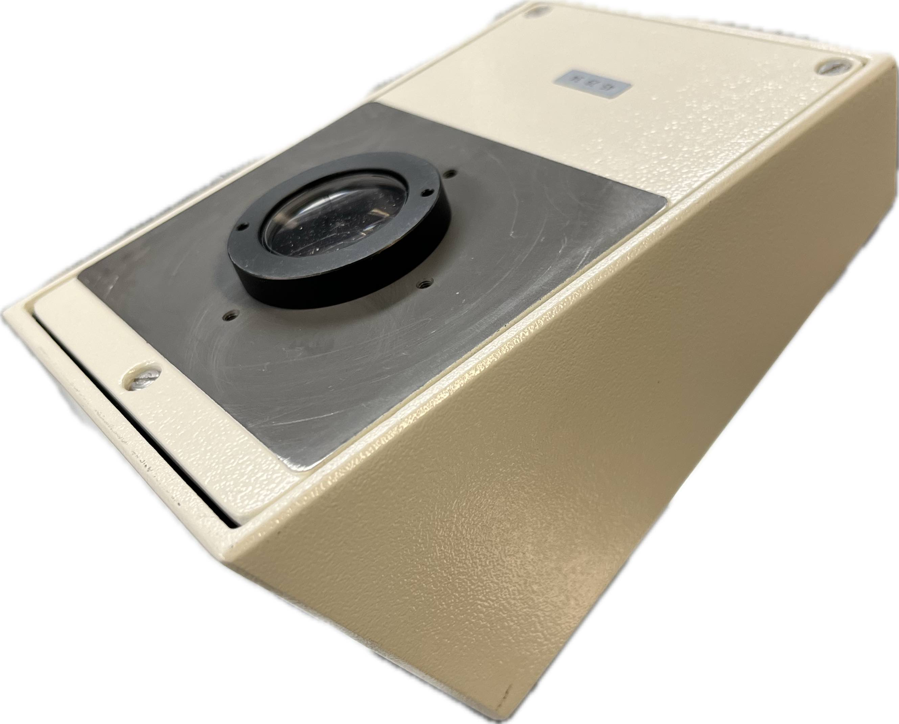

# Photoluminescence fiber collection

The top of the WITec microscope comes configured from the manufacturer to
collect the photoluminescence signal onto the core of a multi-mode fiber. The
discrimination afforded by the small core diameter of the fiber acts as
a pinhole detector, enforcing a key requirement of confocal microscopy.

The existing fiber positioner is suited for moving the core of the input fiber
into the fixed path of the reflected PL signal. Once aligned, the output of the
multi-mode fiber can be directed to a number of instruments without requiring
fiber realignment.

## Problem

The existing fiber positioner and end-point detectors that accompany the WITec
measurement depend on fibers with SMA connectors. Explicitly, these detectors
are the Princeton Instruments Acton 300i spectrometer and the APD
photon-counting module integrated underneath the WITec microscope stage.

We wish to integrate more detectors into this setup.

We have a fiber-coupled external Hanbury Brown–Twiss (HBT) interferometer
capable of single-photon characterization. This uses a custom fiber with an
integrated beam splitter, whose single input and double output fibers use FC/PC
connectors. The fiber input is suitable for cases where we want permanent and
dedicated input alignment to the interferometer while maintaining configurable
downstream components in the optical pathway without significant re-alignment
costs.

The FC/PC input fiber to the HBT is incompatible with the WITec SMA fiber
positioner.

The lowest-cost solutions involve using a single SMA-to-FC/PC adapter or
replacing the custom fiber-based beam splitter for one with an SMA input
connector. Each of these solutions would also require disconnecting the fiber
at the microscope connection instead of at the detector connection. This means
that switching between a spectrometer measurement (SMA fiber) and
a complementary single-photon measurement (FC/PC fiber) would require
re-alignment onto the respective fiber core. This impedes rapid studies of
correlated measurements on a single sample.

## Solution

We seek a modification to the fiber coupling atop the WITec microscope that
would accept two types of fibers with an easily switchable configuration. The
original SMA fiber would continue to the spectrometer or photon counting
module, and the FC/PC fiber would incorporate the HBT interferometer.

The target of our modification is summarized by the mock-up in the figure
below.

The essential criterion is that our modifications should allow for reversible
and repeatable reconfiguration between the two fiber ports. As a secondary
consideration, we want the reconfiguration to be programmable.

Based on the original configuration shown below, we decided the best course of
action was to extend the infinity space---the region between the
infinity-corrected microscope objective (5) and the tube lens (7)---to make
room for us to implement a custom diverter atop the microscope.

### Modifications

The schematic figure below illustrates the top of the WITec microscope, which
holds a prism diverter assembly capable of directing the optical path to the
binocular lens or top fiber coupler. The prism diverter assembly is aligned to
its base by an aluminum alignment collar, held in place by a set screw under
the push-rod prism diverter (3).

The picture below shows the original tube lens mounted under the prism
assembly, with the aluminum alignment collar temporarily removed for visual
clarity. The tube lens is screwed tightly into the bottom of the prism
assembly. 

We removed the tube lens, re-secured the alignment collar, and reassembled the
microscope. We then replaced the top fiber positioner with a cage assembly
capable of directing the collimated light exiting the top of the microscope
into one of two arms. In each arm, the light is focused onto the core of
a fiber. The cage contains a longer focal length tube lens and a mechanised
diverter to select between collection arms.

To secure this cage to the top of the microscope, we made a custom adapter
plate to replace the fiber positioner and provide the base for the upright
cage. The mechanical arm for the diverter mirror is mounted to a metal plate
customized to fit inside the cage rods. We elevated this support plate above
the adapter plate to allow for tunable spectral filtering. The longer focal
length tube lens was necessary in this cage to allow for the diverter arm to
swing in and out of position. The diverter mirror can be controlled by
software, but we currently use a button switch to toggle between the two states
manually.

The original 163 mm tube lens was moved to the eyepiece side of the top prism
diverter. We removed the binocular assembly and 3D printed a custom holder to
fix the video camera at the focal length of the tube lens.

### Summary of components

Machined parts

- [`logs/optics/media/WITec_adapter_plate.pdf`](media/WITec_adapter_plate.pdf)
- [`logs/optics/media/WITec_support_plate.pdf`](media/WITec_support_plate.pdf)

3D printed parts

- [`logs/optics/media/WITec_binocular_adapter.pdf`](media/WITec_binocular_adapter.pdf)
    - Made to hold the original WITec tube lens
    - 

Purchased parts

| Part Description                                                    | Thorlabs Part Number | Quantity |
|---------------------------------------------------------------------|----------------------|----------|
| Cage Assembly Rod, 12" Long, Ø6 mm                                  | ER12                 | 4        |
| Cage Assembly Rod, 2" Long, Ø6 mm                                   | ER2-P4               | 2        |
| Cage Assembly Rod, 3" Long, Ø6 mm, 4 Pack                           | ER3-P4               | 2        |
| XYZ Translation Mount for Ø1" Optics, 1/4"-20 Taps                  | CXYZ1A               | 3        |
| N-BK7 Plano-Convex Lens, Ø1", f = 175 mm, AR Coating: 400 - 1100 nm | LA1229-AB            | 1        |
| Motorized Filter Flip Mount with Ø1" Optic Holder, 8-32 Tap         | MFF101               | 1        |
| 60 mm to 60 mm Cage System Right-Angle Adapter                      | LCP60                | 1        |
| Ø1" FC/PC Fiber Adapter Plate Without Threads, Wide Key (2.2 mm)    | S1FC                 | 1        |
| Ø1" SMA Fiber Adapter Plate Without Threads                         | S1SMA                | 1        |
| Pivoting, Quick-Release, Ø1" Optic Mount for 30 mm Cage System      | CP360Q               | 2        |

## Results

The final assembly appears below.

This new configuration allows for single-photon detection and rapid evaluation
of spectra in one microscope, under the same stage coordinates, and in a nearly
seamless switchable configuration.
