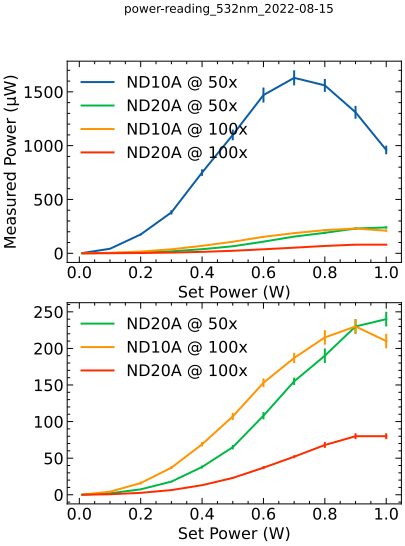

The measurements from Aug 14 suggest there is more loss than expected at each
of the microscope objectives. This suggests a misalignment of the fiber into
the microscope.

I adjusted the set screw on the SMA connector that brings the fiber into the
back of the WITec microscope until the laser spot size was minimized on the
camera. I then remeasured the power after each microscope objective.

| Location                        | Measured Power (mW) |
|---------------------------------|---------------------|
| After fiber exit                | 6.1  ± 0.3          |
| After 50x microscope objective  | 2.46 ± 0.12         |
| After 100x microscope objective | 0.84 ± 0.06         |

# Notes

- The laser from the fiber is directed down to the sample by use of a 50:50
  cube beam splitter. The theoretical maximum power that should reach the
  sample is 3 mW.
- The 100x objective has less throughput because it has a different numerical aperture (NA) than the 50x objective.
    - I have not quantified the beam size after the fiber or the theoretical throughput based on the NA. So long as I can quantify the power through the objective, I am not yet worried about optimizing the NA.

I next want to quantify the power at the sample based on various laser powers
as set by the power supply and by use of neutral density (ND) filters placed
before the objective coupling to the input of the fiber.

| Set Power (W) | ND Filter | Microscope Objective | Measured Power (µW) |
|---------------|-----------|----------------------|---------------------|
| 0.01          | ND10A     | 50x                  | 2.5  ± 0.1          |
| 0.10          | ND10A     | 50x                  | 42   ± 3            |
| 0.20          | ND10A     | 50x                  | 175  ± 8            |
| 0.30          | ND10A     | 50x                  | 380  ± 20           |
| 0.40          | ND10A     | 50x                  | 750  ± 30           |
| 0.50          | ND10A     | 50x                  | 1100 ± 50           |
| 0.60          | ND10A     | 50x                  | 1470 ± 70           |
| 0.70          | ND10A     | 50x                  | 1630 ± 70           |
| 0.80          | ND10A     | 50x                  | 1560 ± 60           |
| 0.90          | ND10A     | 50x                  | 1310 ± 60           |
| 1.00          | ND10A     | 50x                  | 960  ± 40           |
| 0.01          | ND20A     | 50x                  | 0.08 ± 0.01         |
| 0.10          | ND20A     | 50x                  | 2.0  ± 0.1          |
| 0.20          | ND20A     | 50x                  | 7.4  ± 0.4          |
| 0.30          | ND20A     | 50x                  | 18   ± 1            |
| 0.40          | ND20A     | 50x                  | 38   ± 2            |
| 0.50          | ND20A     | 50x                  | 65   ± 3            |
| 0.60          | ND20A     | 50x                  | 108  ± 5            |
| 0.70          | ND20A     | 50x                  | 155  ± 5            |
| 0.80          | ND20A     | 50x                  | 190  ± 10           |
| 0.90          | ND20A     | 50x                  | 230  ± 10           |
| 1.00          | ND20A     | 50x                  | 240  ± 10           |
| 0.01          | ND10A     | 100x                 | 0.17 ± 0.2          |
| 0.10          | ND10A     | 100x                 | 4.2  ± 0.3          |
| 0.20          | ND10A     | 100x                 | 16   ± 2            |
| 0.30          | ND10A     | 100x                 | 37   ± 2            |
| 0.40          | ND10A     | 100x                 | 69   ± 3            |
| 0.50          | ND10A     | 100x                 | 107  ± 5            |
| 0.60          | ND10A     | 100x                 | 153  ± 6            |
| 0.70          | ND10A     | 100x                 | 187  ± 7            |
| 0.80          | ND10A     | 100x                 | 215  ± 10           |
| 0.90          | ND10A     | 100x                 | 230  ± 10           |
| 1.00          | ND10A     | 100x                 | 210  ± 10           |
| 0.01          | ND20A     | 100x                 | 0.03 ± 0.01         |
| 0.10          | ND20A     | 100x                 | 0.68 ± 0.04         |
| 0.20          | ND20A     | 100x                 | 2.6  ± 0.2          |
| 0.30          | ND20A     | 100x                 | 6.4  ± 0.3          |
| 0.40          | ND20A     | 100x                 | 13.1 ± 0.6          |
| 0.50          | ND20A     | 100x                 | 23   ± 1            |
| 0.60          | ND20A     | 100x                 | 37   ± 2            |
| 0.70          | ND20A     | 100x                 | 52   ± 2            |
| 0.80          | ND20A     | 100x                 | 68   ± 4            |
| 0.90          | ND20A     | 100x                 | 80   ± 4            |
| 1.00          | ND20A     | 100x                 | 80   ± 4            |

```python
import pathlib

import matplotlib.pyplot as plt
import pandas as pd
import scienceplots

from markdown_tools import extract_data

# Gather variables from filename
filename = "power-reading_532nm_2022-08-15.md"
source = pathlib.Path(filename)
target = pathlib.Path("media") / source.name

verdi_power = extract_data(source, index=1)
# set boolean masks
ND10A = verdi_power["ND Filter"].isin(["ND10A"])
ND20A = verdi_power["ND Filter"].isin(["ND20A"])
obj_50 = verdi_power["Microscope Objective"].isin(["50x"])
obj_100 = verdi_power["Microscope Objective"].isin(["100x"])
# Use boolean masks to pick subsets of entire dataframe
ND10A_50 = verdi_power.loc[ND10A & obj_50]
ND10A_100 = verdi_power.loc[ND10A & obj_100]
ND20A_50 = verdi_power.loc[ND20A & obj_50]
ND20A_100 = verdi_power.loc[ND20A & obj_100]
# Plot each subset
with plt.style.context(["default", "science", "notebook"]):
    fig, [ax1, ax2] = plt.subplots(2, 1, figsize=(6, 8))
    fig.suptitle(source.stem)
    ND10A_50.plot(
        ax=ax1,
        y="Measured Power (µW)",
        yerr="± Measured Power (µW)",
        label="ND10A @ 50x",
    )
    ND20A_50.plot(
        ax=ax1,
        y="Measured Power (µW)",
        yerr="± Measured Power (µW)",
        label="ND20A @ 50x",
    )
    ND10A_100.plot(
        ax=ax1,
        y="Measured Power (µW)",
        yerr="± Measured Power (µW)",
        label="ND10A @ 100x",
    )
    ND20A_100.plot(
        ax=ax1,
        y="Measured Power (µW)",
        yerr="± Measured Power (µW)",
        label="ND20A @ 100x",
    )

    # Also plot weaker laser plots in separate plot for more detail
    ax2._get_lines.get_next_color()  # Skip 1st color so ax1 and ax2 match
    ND20A_50.plot(
        ax=ax2,
        y="Measured Power (µW)",
        yerr="± Measured Power (µW)",
        label="ND20A @ 50x",
    )
    ND10A_100.plot(
        ax=ax2,
        y="Measured Power (µW)",
        yerr="± Measured Power (µW)",
        label="ND10A @ 100x",
    )
    ND20A_100.plot(
        ax=ax2,
        y="Measured Power (µW)",
        yerr="± Measured Power (µW)",
        label="ND20A @ 100x",
    )
    ax.set_ylabel("Measured Power (µW)")

    figname = target.with_suffix(".svg")
    fig.savefig(figname)
    print(f"Figure saved to {figname}")
plt.show()
```


