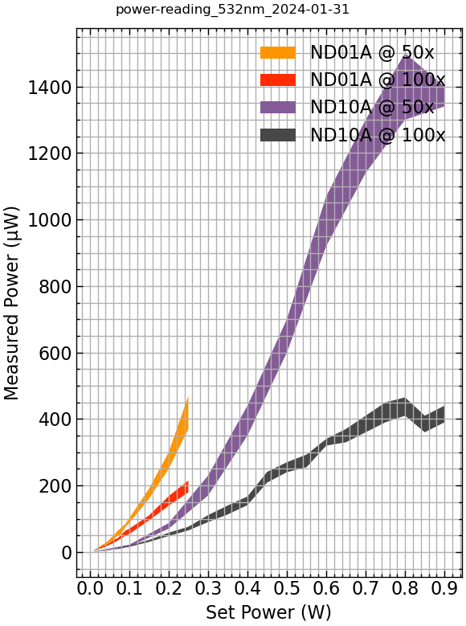

I ran the LBO optimization on January 26, 2024, and am interested in the new
power profile of the output laser beam.

I cleaned both ends of the yellow single-mode fiber that runs from the Newport
fiber coupler to the back of the WITec microscope and re-aligned the 10x
microscope objective that couples the free-space laser into the fiber.

Because I realigned the free-space coupling lens, I wanted to see the power
loses at each step in the beam path to see if realignment into the fiber
affects the coupling at the back of the WITec microscope into the microscope
objectives. I was also interested to see if the beam profile of the laser is
evolving in any obvious way that would hint at at fundamental mode change with
increasing set power.

| Set power (W) | Power @ Verdi shutter (mW) | Power @ fiber out (mW) | Power @ 50x obj (mW) | Power @ 100x obj (mW) |
|---------------|----------------------------|------------------------|----------------------|-----------------------|
| 0.01          | 14.5–15.1                  | 8.8–9.3                | 2.8–3.3              | 0.8–0.9               |
| 0.02          | 24.6–25.1                  | 13.97–15.81            | 4.7–5.4              | 1.3–1.5               |
| 0.03          | 34.5–35.6                  | 19.8–22                | 6.2–7.9              | 1.8–2.1               |
| 0.04          | N/A                        | 25.6–28.6              | 8.6–9.8              | 2.36–2.74             |

I did not go above 40 mW of raw output power into the fiber to avoid burning
the fiber. Thorlabs says that the fibers are rated up to 70 mW before they meet
a permanent damage threshold.

I next want to quantify the power at the sample based on various laser powers
as set by the power supply and by use of neutral density (ND) filters placed
before the objective coupling to the input of the fiber.

| Set Power (W) | ND Filter | Microscope Objective | Min Power (µW) | Max Power (µW) |
|---------------|-----------|----------------------|----------------|----------------|
| 0.01          | ND01A     | 50x                  | 4.3            | 6.2            |
| 0.02          | ND01A     | 50x                  | 9.0            | 11.7           |
| 0.03          | ND01A     | 50x                  | 13.1           | 21.2           |
| 0.04          | ND01A     | 50x                  | 19.5           | 27.1           |
| 0.05          | ND01A     | 50x                  | 28             | 38             |
| 0.06          | ND01A     | 50x                  | 37             | 50             |
| 0.07          | ND01A     | 50x                  | 48             | 63             |
| 0.08          | ND01A     | 50x                  | 54             | 74             |
| 0.09          | ND01A     | 50x                  | 75             | 84             |
| 0.10          | ND01A     | 50x                  | 87             | 102            |
| 0.15          | ND01A     | 50x                  | 160            | 190            |
| 0.20          | ND01A     | 50x                  | 250            | 300            |
| 0.25          | ND01A     | 50x                  | 370            | 470            |
| 0.01          | ND01A     | 100x                 | 4.0            | 5.0            |
| 0.02          | ND01A     | 100x                 | 8.1            | 10.6           |
| 0.03          | ND01A     | 100x                 | 12.1           | 16.2           |
| 0.04          | ND01A     | 100x                 | 16             | 21             |
| 0.05          | ND01A     | 100x                 | 22             | 27             |
| 0.06          | ND01A     | 100x                 | 27             | 37             |
| 0.07          | ND01A     | 100x                 | 34             | 41             |
| 0.08          | ND01A     | 100x                 | 41             | 52             |
| 0.09          | ND01A     | 100x                 | 49             | 64             |
| 0.10          | ND01A     | 100x                 | 54             | 70             |
| 0.15          | ND01A     | 100x                 | 95             | 110            |
| 0.20          | ND01A     | 100x                 | 139            | 168            |
| 0.25          | ND01A     | 100x                 | 180            | 215            |
| 0.01          | ND10A     | 50x                  | 1.0            | 1.7            |
| 0.10          | ND10A     | 50x                  | 16             | 22             |
| 0.20          | ND10A     | 50x                  | 70             | 87             |
| 0.30          | ND10A     | 50x                  | 170            | 230            |
| 0.40          | ND10A     | 50x                  | 350            | 440            |
| 0.50          | ND10A     | 50x                  | 600            | 700            |
| 0.60          | ND10A     | 50x                  | 920            | 1070           |
| 0.70          | ND10A     | 50x                  | 1140           | 1300           |
| 0.80          | ND10A     | 50x                  | 1300           | 1500           |
| 0.90          | ND10A     | 50x                  | 1340           | 1400           |
| 0.01          | ND10A     | 100x                 | 0.9            | 1.4            |
| 0.02          | ND10A     | 100x                 | 1.8            | 2.6            |
| 0.03          | ND10A     | 100x                 | 3.2            | 4.1            |
| 0.04          | ND10A     | 100x                 | 3.4            | 4.8            |
| 0.05          | ND10A     | 100x                 | 5.2            | 6.6            |
| 0.06          | ND10A     | 100x                 | 7.7            | 9.0            |
| 0.07          | ND10A     | 100x                 | 8.8            | 10.7           |
| 0.08          | ND10A     | 100x                 | 10.7           | 13.9           |
| 0.09          | ND10A     | 100x                 | 13.6           | 17.2           |
| 0.10          | ND10A     | 100x                 | 15.7           | 19.1           |
| 0.15          | ND10A     | 100x                 | 30.4           | 36.3           |
| 0.20          | ND10A     | 100x                 | 48             | 58             |
| 0.25          | ND10A     | 100x                 | 65             | 76             |
| 0.30          | ND10A     | 100x                 | 90             | 111            |
| 0.35          | ND10A     | 100x                 | 113            | 140            |
| 0.40          | ND10A     | 100x                 | 141            | 167            |
| 0.45          | ND10A     | 100x                 | 209            | 241            |
| 0.50          | ND10A     | 100x                 | 240            | 270            |
| 0.55          | ND10A     | 100x                 | 255            | 293            |
| 0.60          | ND10A     | 100x                 | 320            | 340            |
| 0.65          | ND10A     | 100x                 | 330            | 370            |
| 0.70          | ND10A     | 100x                 | 360            | 410            |
| 0.75          | ND10A     | 100x                 | 390            | 450            |
| 0.80          | ND10A     | 100x                 | 410            | 465            |
| 0.85          | ND10A     | 100x                 | 360            | 410            |
| 0.90          | ND10A     | 100x                 | 390            | 440            |
| 0.01          | ND20A     | 50x                  | 0.03           | 0.04           |

```python
import os

import matplotlib.pyplot as plt
from matplotlib.ticker import MultipleLocator
import pandas as pd
import scienceplots

from markdown_tools import extract_data

# Gather variables from filename
filename = "power-reading_532nm_2024-01-31.md"
slug = os.path.splitext((filename))[0]
basename = os.path.basename(slug)

verdi_power = extract_data(filename, index=1)
# set boolean masks
ND01A = verdi_power["ND Filter"].isin(["ND01A"])
ND10A = verdi_power["ND Filter"].isin(["ND10A"])
ND20A = verdi_power["ND Filter"].isin(["ND20A"])
obj_50 = verdi_power["Microscope Objective"].isin(["50x"])
obj_100 = verdi_power["Microscope Objective"].isin(["100x"])
# Use boolean masks to pick subsets of entire dataframe
ND01A_50 = verdi_power.loc[ND01A & obj_50]
ND01A_100 = verdi_power.loc[ND01A & obj_100]
ND10A_50 = verdi_power.loc[ND10A & obj_50]
ND10A_100 = verdi_power.loc[ND10A & obj_100]

# Plot each subset
with plt.style.context(["default", "science", "notebook"]):
    fig, ax = plt.subplots(figsize=(6, 8))
    fig.suptitle(basename)
    # Reserve the first two fill colors
    # for unfiltered measurements
    ax._get_patches_for_fill.get_next_color()
    ax._get_patches_for_fill.get_next_color()
    ax.fill_between(
        ND01A_50.index,
        ND01A_50["Min Power (µW)"],
        ND01A_50["Max Power (µW)"],
        label="ND01A @ 50x",
    )
    ax.fill_between(
        ND01A_100.index,
        ND01A_100["Min Power (µW)"],
        ND01A_100["Max Power (µW)"],
        label="ND01A @ 100x",
    )
    ax.fill_between(
        ND10A_50.index,
        ND10A_50["Min Power (µW)"],
        ND10A_50["Max Power (µW)"],
        label="ND10A @ 50x",
    )
    ax.fill_between(
        ND10A_100.index,
        ND10A_100["Min Power (µW)"],
        ND10A_100["Max Power (µW)"],
        label="ND10A @ 100x",
    )
    ax.legend()
    ax.xaxis.set_major_locator(MultipleLocator(0.1))
    ax.grid(True, which="both")
    ax.set_ylabel("Measured Power (µW)")
    ax.set_xlabel("Set Power (W)")
    
    plt.tight_layout()
    figname = f"{slug}.png"
    fig.savefig(figname)
    print(f"Figure saved to {figname}")
plt.show()
```


