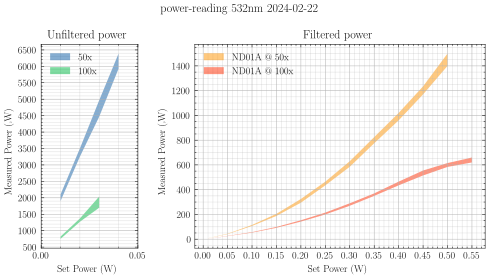

There is a significant amount of signal coming into the spectrometer that
doesn't appear to be any Raman signal or photoluminescence from the sample. We
know this because the signal in the spectrometer remains even after switching
samples under the microscope.

I suspected this was coming from fluorescence in the fiber, so earlier this
month I further investigated switching out the single-mode fiber in case the
fiber had a microfracture or other small defect causing scattering into the
cladding that was weakly fluorescing.

The results of my troubleshooting were detailed starting on January 25 and
continued until February 16. These notes can be found
[here](../laser/laser_alignment.md).

After this investigation, I settled on a laser alignment with a laser line
clean up filter after the fiber and before the beam splitter. My alignment is
detailed by my new power output characterizations at various points along the
beam path.

Configuration
: Verdi -> 10x objective -> SM fiber -> LL filter -> 50:50 BS -> Obj -> Sample -> Obj -> 50:50 BS -> MM out

Diode current
: 23.52 A

| Set power (W) | Location                             | Measured Power (mW) |
|---------------|--------------------------------------|---------------------|
| 0.01          | Verdi shutter                        | 14.65 ± 0.12        |
| 0.01          | Single-mode fiber out                | 8.4   ± 0.2         |
| 0.01          | Sample (50x objective)               | 2.00  ± 0.05        |
| 0.01          | Multi-mode fiber out (50x)           | 0.17  ± 0.01        |
| 0.01          | 532 LP + Multi-mode fiber out (50x)  | 0.03  ± 0.01        |
| 0.01          | Sample (100x objective)              | 0.79  ± 0.02        |
| 0.01          | Multi-mode fiber out (100x)          | 0.04  ± 0.005       |
| 0.01          | 532 LP + Multi-mode fiber out (100x) | 0.03  ± 0.01        |

I next investigated the measured power output at the sample under various
configurations. For measurements that involved a neutral density filter before
the single-mode fiber, the filter was rotated until I achieved maximum throughput.

| Set Power (W) | ND Filter | Microscope Objective | Min Power (µW) | Max Power (µW) |
|---------------|-----------|----------------------|----------------|----------------|
| 0.01          | None      | 50x                  | 1900           | 2100           |
| 0.02          | None      | 50x                  | 3250           | 3500           |
| 0.03          | None      | 50x                  | 4470           | 4970           |
| 0.04          | None      | 50x                  | 5930           | 6390           |
| 0.01          | ND01A     | 50x                  | 7.0            | 7.7            |
| 0.05          | ND01A     | 50x                  | 41             | 44             |
| 0.10          | ND01A     | 50x                  | 107            | 115            |
| 0.15          | ND01A     | 50x                  | 188            | 205            |
| 0.20          | ND01A     | 50x                  | 295            | 325            |
| 0.25          | ND01A     | 50x                  | 435            | 465            |
| 0.30          | ND01A     | 50x                  | 585            | 630            |
| 0.35          | ND01A     | 50x                  | 775            | 825            |
| 0.40          | ND01A     | 50x                  | 960            | 1020           |
| 0.45          | ND01A     | 50x                  | 1170           | 1235           |
| 0.50          | ND01A     | 50x                  | 1400           | 1500           |
| 0.01          | None      | 100x                 | 750            | 820            |
| 0.02          | None      | 100x                 | 1270           | 1370           |
| 0.03          | None      | 100x                 | 1700           | 2040           |
| 0.01          | ND01A     | 100x                 | 2.3            | 2.5            |
| 0.10          | ND01A     | 100x                 | 53             | 57             |
| 0.15          | ND01A     | 100x                 | 92             | 99             |
| 0.20          | ND01A     | 100x                 | 142            | 153            |
| 0.25          | ND01A     | 100x                 | 200            | 215            |
| 0.30          | ND01A     | 100x                 | 270            | 290            |
| 0.35          | ND01A     | 100x                 | 350            | 370            |
| 0.40          | ND01A     | 100x                 | 435            | 465            |
| 0.45          | ND01A     | 100x                 | 515            | 555            |
| 0.50          | ND01A     | 100x                 | 584            | 615            |
| 0.55          | ND01A     | 100x                 | 620            | 660            |

```python
import pathlib

import matplotlib.pyplot as plt
from matplotlib.ticker import MultipleLocator
import pandas as pd
import scienceplots

from markdown_tools import extract_data

# Gather variables from filename
filename = "power-reading_532nm_2024-02-22.md"
source = pathlib.Path(filename)
target = pathlib.Path("media") / source.name

verdi_power = extract_data(source, index=1)
# set boolean masks
ND01A = verdi_power["ND Filter"].isin(["ND01A"])
No_filter = verdi_power["ND Filter"].isin(["None"])
obj_50 = verdi_power["Microscope Objective"].isin(["50x"])
obj_100 = verdi_power["Microscope Objective"].isin(["100x"])
# Use boolean masks to pick subsets of entire dataframe
None_50 = verdi_power.loc[No_filter & obj_50]
None_100 = verdi_power.loc[No_filter & obj_100]
ND01A_50 = verdi_power.loc[ND01A & obj_50]
ND01A_100 = verdi_power.loc[ND01A & obj_100]

# Plot each subset
with plt.style.context(["default", "science"]):
    fig, [ax1, ax2] = plt.subplots(1, 2, width_ratios=[1,3], figsize=(7, 4))
    fig.suptitle(source.stem)
    
    ax1.set_title("Unfiltered power")
    ax1.xaxis.set_major_locator(MultipleLocator(0.05))
    ax1.yaxis.set_major_locator(MultipleLocator(500))
    ax1.grid(which="major")
    ax1.grid(which="minor", alpha=0.4)
    ax1.set_xlim(None, 0.05)
    ax1.set_ylabel("Measured Power (µW)")
    ax1.set_xlabel("Set Power (W)")
    ax1.fill_between(
        None_50.index,
        None_50["Min Power (µW)"],
        None_50["Max Power (µW)"],
        label="50x",
        alpha=0.5,
    )
    ax1.fill_between(
        None_100.index,
        None_100["Min Power (µW)"],
        None_100["Max Power (µW)"],
        label="100x",
        alpha=0.5,
    )
    ax1.legend(loc="upper left")

    # Skip first two fill colors
    # so that next axis picks up where previous axis left off
    ax2._get_patches_for_fill.get_next_color()
    ax2._get_patches_for_fill.get_next_color()

    ax2.set_title("Filtered power")
    ax2.xaxis.set_major_locator(MultipleLocator(0.05))
    ax2.grid(which="major")
    ax2.grid(which="minor", alpha=0.4)
    ax2.set_ylabel("Measured Power (µW)")
    ax2.set_xlabel("Set Power (W)")
    ax2.fill_between(
        ND01A_50.index,
        ND01A_50["Min Power (µW)"],
        ND01A_50["Max Power (µW)"],
        label="ND01A @ 50x",
        alpha=0.5,
    )
    ax2.fill_between(
        ND01A_100.index,
        ND01A_100["Min Power (µW)"],
        ND01A_100["Max Power (µW)"],
        label="ND01A @ 100x",
        alpha=0.5,
    )
    ax2.legend()
    
    plt.tight_layout()
    figname = target.with_suffix(".svg")
    fig.savefig(figname)
    print(f"Figure saved to {figname}")
plt.show()
```


