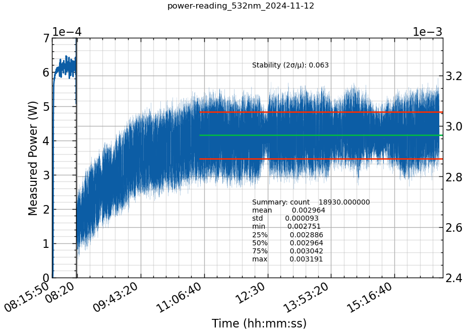

We are interested in the long-term stability of the Verdi output. We monitored
the laser power over the course of several hours. The laser has been on standby
since the night before, and we began collecting power readings shortly after
turning the laser on and maintained at its lowest setting of 0.01 W.

The power was monitored at the sample without an objective, so as to include
a standard reference for effective alignment. More exactly, the power meter was
positioned up into the vacant recessed turret that holds microscope objectives
in the WITec so that the laser readings are light-tight from inside the
microscope and would be unaffected by changes in room lighting throughout the
day.

Configuration
: Verdi -> 10x objective -> SM fiber -> LL filter -> 50:50 BS -> Obj -> Sample

Diode current
: 23.52 A

- `data/laser/Verdi-V5_plog_0010mW_f-0_23.52A_power_2024-11-12.csv`

```python
import datetime
import os

import numpy as np
import matplotlib.pyplot as plt
from matplotlib.ticker import MultipleLocator
from matplotlib.dates import HourLocator, DateFormatter
import pandas as pd
import scienceplots

# Gather variables from filename
data_path = "../../data/laser/Verdi-V5_plog_0010mW_f-0_23.52A_power_2024-11-12.csv"
filename = "power-reading_532nm_2024-11-12.md"
slug = os.path.splitext((filename))[0]
basename = os.path.basename(slug)

start = datetime.time(8, 15, 50)
stop_low = datetime.time(8, 18, 56)
start_high = datetime.time(8, 18, 57)
stable_cutoff = datetime.time(11, 0, 0)
stop = datetime.time(16, 20, 0)

verdi_power = pd.read_csv(data_path, skiprows=14)
verdi_power["Time (hh:mm:ss)"] = pd.to_datetime(verdi_power["Time of day (hh:mm:ss) "], format="%H:%M:%S.%f", exact=False).dt.time
stable_region = verdi_power[verdi_power["Time (hh:mm:ss)"] > stable_cutoff]["Power (W)"]
laser_mean = stable_region.mean()
laser_std = stable_region.std()
laser_variance = laser_std ** 2

with plt.style.context(["default", "science", "notebook"]):
    fig, [ax1, ax2] = plt.subplots(1, 2, width_ratios=(1,15), figsize=(10,7))
    fig.suptitle(basename)
    verdi_power.plot(ax=ax1, x="Time (hh:mm:ss)", y="Power (W)", xlim=(start, stop_low), ylim=(0, 7e-4))
    ax1.set_ylabel("Measured Power (W)")
    ax1.set_xlabel("")
    ax1.xaxis.set_ticks(ticks=(start,))
    
    verdi_power.plot(ax=ax2, x="Time (hh:mm:ss)", y="Power (W)", xlim=(start_high, stop), ylim=(2.4e-3, None), lw=0.1)
    ax2.hlines(y=laser_mean - laser_std, xmin=stable_cutoff, xmax=stop, colors="C3")
    ax2.hlines(y=laser_mean, xmin=stable_cutoff, xmax=stop, colors="C1")
    ax2.hlines(y=laser_mean + laser_std, xmin=stable_cutoff, xmax=stop, colors="C3")
    ax2.annotate(f"Stability (2σ/µ): {2 * laser_std/laser_mean:.3f}",
                 xy=(0.5, 0.75), xycoords='figure fraction')
    ax2.annotate(f"Summary: {stable_region.describe().to_string()}",
                 xy=(0.5, 0.20), xycoords='figure fraction')
    ax2.yaxis.tick_right()
    
    for ax in [ax1, ax2]:
        ax.grid(which="minor", alpha=0.4)
        ax.grid(which="major")
        ax.get_legend().remove()
        ax.ticklabel_format(axis="y", style="sci", scilimits=(-2,2))
    

    fig.autofmt_xdate()
    fig.subplots_adjust(wspace=0, hspace=0)
    figname = f"{slug}.png"
    fig.savefig(figname)
    print(f"Figure saved to {figname}")
plt.show()
```



> At 8:18, we realized the additional 50:50 beam splitter prism that directs
white light onto the sample was still in place. It was removed from the path
and the remaining measurements for the day are logged as intended.
