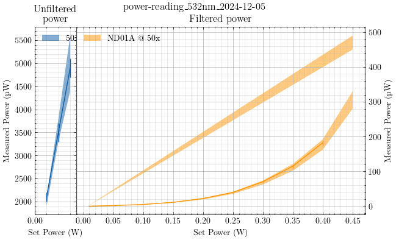

I placed the ND filter immediately before the 10x focusing objective that
couples the free-space Verdi laser output into the single-mode fiber.
I situated the power meter roughly at focus of the 50x objective, being
careful not to come to a tight focus. This is so that I do not damage the
sensor at high laser power where the power per unit area can be exceptionally
large, even though the overall power is within the detectable power range of
the sensor (0–30 mW). I jointly monitored the camera feed of the reflected
laser light as if I were viewing a sample.

I notice that the apparent beam profile changes when I place any number of ND
filters in the beam path. This is evident by larger scattering artifacts in
the camera feed, such as a starburst pattern of the reflected light from the
internal beam splitters and a less-pronounced focused beam spot size when
viewing a sample in the microscope.

I rotated the ND filter around its central axis like hands on a clock until
I achieved the smallest measured power after the objective. This resulted in
the least intense starburst artifacts. I then adjusted the requested laser
power on the front panel controls and recorded the measured power at the sample
for various settings.

Configuration
: Verdi -> ND filter -> 10x objective -> SM fiber -> LL filter -> 50:50 BS -> Obj -> Sample


| Set Power (W) | ND Filter | Microscope Objective | Min Power (µW) | Max Power (µW) | Mean Power (µW) | Diode Current (A) |
|---------------|-----------|----------------------|----------------|----------------|-----------------|-------------------|
| 0.01          | None      | 50x                  | 1900           | 2100           | 2100 ± 100      | 23.54             |
| 0.02          | None      | 50x                  | 3300           | 3800           | 3500 ± 200      | 24.00             |
| 0.03          | None      | 50x                  | 4400           | 5600           | 4900 ± 200      | 24.29             |
| 0.01          | ND01A     | 50x                  | 0.43           | 0.50           | 0.45 ± 0.02     | 23.54             |
| 0.05          | ND01A     | 50x                  | 1.95           | 2.34           | 2.1  ± 0.1      | 24.71             |
| 0.10          | ND01A     | 50x                  | 4.7            | 5.6            | 5.3  ± 0.2      | 25.29             |
| 0.15          | ND01A     | 50x                  | 10.1           | 12.0           | 11.5 ± 0.4      | 25.59             |
| 0.20          | ND01A     | 50x                  | 19.7           | 23.5           | 22.4 ± 0.9      | 25.81             |
| 0.25          | ND01A     | 50x                  | 35.7           | 41.7           | 40.0 ± 1.5      | 25.99             |
| 0.30          | ND01A     | 50x                  | 62.5           | 73.9           | 70.7 ± 3.0      | 26.09             |
| 0.35          | ND01A     | 50x                  | 101.8          | 121.3          | 115  ± 5        | 26.26             |
| 0.40          | ND01A     | 50x                  | 162            | 192            | 182  ± 7        | 26.33             |
| 0.45          | ND01A     | 50x                  | 280            | 330            |                 | 26.38             |
| 0.45          | ND01A     | 50x                  | 450            | 490            |                 | 26.38             |
| 0.01          | ND01A     | 50x                  | 3.05           | 3.50           | 3.13 ± 0.13     | 23.55             |

When I reached a set power of 0.45 W, I noticed a runaway increase in measured
power at the sample. During this time, the diode current remained steady, and
there were no alerts on the front panel indicating "LASER SEEKING". This
gradual increase in power happened over several minutes. After I set the power
to 450 mW at 17:12, the measured power immediately read around (280–330 µW),
but by 17:16, this reading was (450–490 µW).

I began to suspect that the surface of the reflective ND filter was absorbing
a small amount of the laser power and that the ND coating was breaking down,
so I reduced the laser power and measured a baseline reading at a set power of
0.01 W. This showed a much higher measured power than I initially controlled
for when I rotated the filter to its minimum reading.

There is a chance that this discrepancy in power readings is a result of
hysteresis in the laser diode, so I will return back tomorrow to see if
a fresh start from standby will eliminate this bias.

```python
import os

import matplotlib.pyplot as plt
from matplotlib.ticker import MultipleLocator
import pandas as pd
import scienceplots

from markdown_tools import extract_data

# Gather variables from filename
filename = "power-reading_532nm_2024-12-05.md"
slug = os.path.splitext((filename))[0]
basename = os.path.basename(slug)

verdi_power = extract_data(filename, index=0)
# set boolean masks
ND01A = verdi_power["ND Filter"].isin(["ND01A"])
No_filter = verdi_power["ND Filter"].isin(["None"])
obj_50 = verdi_power["Microscope Objective"].isin(["50x"])
obj_100 = verdi_power["Microscope Objective"].isin(["100x"])
# Use boolean masks to pick subsets of entire dataframe
None_50 = verdi_power.loc[No_filter & obj_50]
None_100 = verdi_power.loc[No_filter & obj_100]
ND01A_50 = verdi_power.loc[ND01A & obj_50]
ND01A_100 = verdi_power.loc[ND01A & obj_100]

# Plot each subset
with plt.style.context(["default", "science"]):
    fig, [ax1, ax2] = plt.subplots(1, 2, width_ratios=[1,7], figsize=(7, 4))
    fig.suptitle(basename)
    
    ax1.set_title("Unfiltered\npower")
    ax1.yaxis.set_major_locator(MultipleLocator(500))
    ax1.set_xlim(None, 0.035)
    ax1.fill_between(
        None_50.index,
        None_50["Min Power (µW)"],
        None_50["Max Power (µW)"],
        label="50x",
        alpha=0.5,
    )
    ax1.errorbar(
        x=None_50.index,
        y=None_50["Mean Power (µW)"],
        yerr=None_50["± Mean Power (µW)"],
    )
    ax1.legend(loc="upper left")
    
    # Skip first two fill colors and line colors
    # so that next axis picks up where previous axis left off
    ax2._get_patches_for_fill.get_next_color()
    ax2._get_patches_for_fill.get_next_color()
    ax2._get_lines.get_next_color()
    ax2._get_lines.get_next_color()
    ax2.fill_between(
        ND01A_50.index,
        ND01A_50["Min Power (µW)"],
        ND01A_50["Max Power (µW)"],
        label="ND01A @ 50x",
        alpha=0.5,
    )
    ax2.errorbar(
        x=ND01A_50.index,
        y=ND01A_50["Mean Power (µW)"],
        yerr=ND01A_50["± Mean Power (µW)"],
    )
    ax2.set_title("Filtered power")
    ax2.yaxis.set_label_position("right")
    ax2.yaxis.tick_right()
    ax2.legend()

    for ax in [ax1, ax2]:
        ax.xaxis.set_major_locator(MultipleLocator(0.05))
        ax.grid(which="major")
        ax.grid(which="minor", alpha=0.4)
        ax.set_xlabel("Set Power (W)")
        ax.set_ylabel("Measured Power (µW)")
    
    fig.subplots_adjust(wspace=0, hspace=0)
    figname = f"{slug}.png"
    fig.savefig(figname)
    print(f"Figure saved to {figname}")
plt.show()
```


