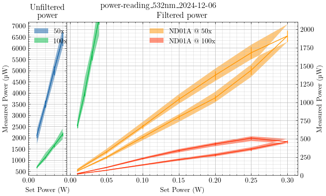

Yesterday's power readings gave me cause for inspection on the integrity of the
neutral density filters.

The theoretical transmission through ND = 0.1 is approximately 80% of the
unattenuated power. For an unfiltered measured power of 2.1 mW at the sample,
placing an ND = 0.1 filter in the beam path should reduce this effective power
at the sample to 1.7 mW, yet we are measuring anywhere from 0.5 µW to 50 µW
depending on the orientation of the ND filter.

Yesterday, I measured the power with the ND filter rotated to its minimum
throughput. My operating assumption was that because this minimized the
artifacts I saw of the reflected laser light in the video feed that this
orientation was using the least adulterated section of a worn ND filter.

Today, I tried measuring the laser power with the ND filter rotated to its
maximum throughput. My assumption here is that any burning or ablating of the
surface of the ND filter would already be done, and that I could operate at
lower power and reduce any further damage, thereby ensuring steady-state
results.

Because I noticed the steady growth in measured laser power at a setting of
0.45 W, I checked to see if this behavior happened under the new filter
orientation.

I turned the laser on from standby with a set power of 0.01 W and waited one
hour. During this time I configured the ND filter for maximum throughput as
measured at the 50x objective. The unfiltered reading was still around 2.1 mW,
and the new filtered reading was around 50 µW.

After approximately one hour, I set the laser power to 0.45 W. The initial
filtered reading at the 50x objective was around 3 mW, and within several
minutes this measurement reduced to 1.4 mW. This seems to me to indicate
continued burning of the surface of the ND filter.

When I reduced the power to 0.01 W, the measured filter laser power no longer
read 50 µW but was instead closer to 5 µW.

I rotated the filter to again be at a local maximum in terms of measured
throughput. This was again somewhere around 50 µW, but notably at a different
filter orientation than before.

I then increased the power to 0.2 W and monitored the filtered measured output
at the 50x objective to be around 1.4 mW. After about 10 minutes, this reading
remained at 1.4 mW, with no obvious signs of drift. This tells me either that
the laser output is more locally stable under a setting of 0.2 W than at
0.45 W, or that we are now operating under a regime where the ND filter is not
breaking down.

This particular model of Thorlabs ND filters (ND01A, ND02A, ND10A, etc) has
a rated damage threshold of 5 W/cm under a CW laser. The Verdi laser beam at
the shutter exit is approximately 0.5 cm. Under an assumed uniform
step-function beam profile, this means the Verdi has an average linear power
density of 0.45 W/0.5 cm or 0.9 W/cm. In practice, a Gaussian beam profile has
roughly 2x the peak intensity at the center of the beam, so the highest linear
power density under a set power of 0.45 W may be closer to 2 W/cm. This is
still below the rated damage threshold, but assumes no surface imperfections or
dust on the ND filter.

My conclusion is that we may be operating close to the breakdown limits of the
ND filter when using the Verdi at 0.45 W. I instead advocate that we rotate the
ND filter for maximum throughput, even though we may be slightly affecting the
beam profile by passing through previously affected regions of the ND filter,
so that we may operate at lower power and maintain a uniform operating
procedure based on assumed repeatable conditions.

This conclusion slightly bothers me on principle because I still expect
a filter with ND = 0.1 to transmit roughly 80% of its incident power, and
neither of these ND filter orientations gets us remotely close to that limit.
One potential solution worth investigating in the future is whether the
presence of the ND filter severely distorts, translates, or focuses the beam
profile enough to warrant a completely new re-alignment into the fiber when
a filter is present. I hesitate to explore this solution because it would
warrant a completely new alignment each time we wanted to adjust the range of
accessible powers at our sample. If we are truly operating at 80% transmission
with a filter of ND = 0.1, this also means that we should not exceed a set
laser power of 0.06 W such that the transmitted power into the fiber does not
exceed roughly 50 mW, or the approximate rated power threshold for our
single-mode fiber.

By extension of this conclusion, if we later decide that operating at a steady
laser output of 0.4 W or something significantly higher than the lowest
available powers around 0.01 W is a more appropriate consideration for the
health of the laser diode, then we are limited in our ability to exceed 0.45 W
because of our perceived belief that the ND filters begin to break down at or
above this setting.

---

I now seek to quantify the measured laser power at the sample under various
operating conditions with the new understanding that we must use the ND filter
rotated to the highest throughput so that we may benefit from appreciable power
at the sample while still maintaining relatively low operating powers.

After setting the power, I waited at least 30 seconds for the laser to finish
"LASER SEEKING". In some cases, the "LASER SEEKING" alert didn't disappear
after waiting several minutes. I then recorded the measured power statistics
anyway but made note of this behavior.

Configuration
: Verdi -> ND filter -> 10x objective -> SM fiber -> LL filter -> 50:50 BS -> Obj -> Sample


| Set Power (W) | ND Filter | Microscope Objective | Min Power (µW) | Max Power (µW) | Mean Power (µW) | Diode Current (A) | LASER SEEKING? |
|---------------|-----------|----------------------|----------------|----------------|-----------------|-------------------|----------------|
| 0.01          | None      | 50x                  | 1710           | 2360           | 2100 ± 100      | 23.52             | No             |
| 0.02          | None      | 50x                  | 3230           | 3710           | 3500 ± 150      | 23.97             | No             |
| 0.03          | None      | 50x                  | 4610           | 5320           | 5000 ± 200      | 24.25             | No             |
| 0.04          | None      | 50x                  | 6000           | 6850           | 6400 ± 300      | 24.51             | No             |
| 0.01          | ND01A     | 50x                  | 61             | 89             | 74   ± 4        | 23.51             | No             |
| 0.05          | ND01A     | 50x                  | 293            | 360            | 320  ± 15       | 24.67             | Yes            |
| 0.10          | ND01A     | 50x                  | 645            | 731            | 670  ± 30       | 25.22             | No             |
| 0.15          | ND01A     | 50x                  | 980            | 1110           | 1040 ± 40       | 25.57             | No             |
| 0.20          | ND01A     | 50x                  | 1290           | 1460           | 1370 ± 60       | 25.80             | No             |
| 0.25          | ND01A     | 50x                  | 1590           | 1790           | 1680 ± 80       | 25.93             | No             |
| 0.30          | ND01A     | 50x                  | 1830           | 2070           | 1910 ± 80       | 26.06             | No             |
| 0.25          | ND01A     | 50x                  | 1350           | 1520           | 1440 ± 60       | 25.93             | No             |
| 0.20          | ND01A     | 50x                  | 1000           | 1142           | 1060 ± 40       | 25.80             | No             |
| 0.15          | ND01A     | 50x                  | 732            | 836            | 800  ± 30       | 23.58             | No             |
| 0.10          | ND01A     | 50x                  | 480            | 560            | 520  ± 20       | 25.23             | No             |
| 0.05          | ND01A     | 50x                  | 227            | 260            | 245  ± 15       | 24.68             | Yes            |
| 0.01          | ND01A     | 50x                  | 52             | 62             | 58   ± 3        | 23.51             | No             |
| 0.01          | None      | 100x                 | 630            | 738            | 680  ± 30       | 23.51             | Yes            |
| 0.02          | None      | 100x                 | 1015           | 1320           | 1120 ± 30       | 23.97             | No             |
| 0.03          | None      | 100x                 | 1530           | 1760           | 1640 ± 60       | 24.26             | No             |
| 0.04          | None      | 100x                 | 1920           | 2400           | 2150 ± 80       | 24.51             | No             |
| 0.01          | ND01A     | 100x                 | 22             | 26             | 24 ± 1          | 23.54             | Yes            |
| 0.05          | ND01A     | 100x                 | 100            | 115            | 107 ± 5         | 24.67             | Yes            |
| 0.10          | ND01A     | 100x                 | 217            | 244            | 230 ± 10        | 25.26             | No             |
| 0.15          | ND01A     | 100x                 | 315            | 360            | 340 ± 15        | 25.58             | Yes            |
| 0.20          | ND01A     | 100x                 | 400            | 450            | 430 ± 20        | 25.80             | No             |
| 0.25          | ND01A     | 100x                 | 470            | 535            | 510 ± 20        | 25.96             | No             |
| 0.30          | ND01A     | 100x                 | 440            | 500            | 460 ± 20        | 26.07             | No             |
| 0.25          | ND01A     | 100x                 | 340            | 385            | 360 ± 20        | 25.96             | No             |
| 0.20          | ND01A     | 100x                 | 260            | 300            | 280 ± 15        | 25.80             | No             |
| 0.15          | ND01A     | 100x                 | 200            | 230            | 215 ± 10        | 25.58             | No             |
| 0.10          | ND01A     | 100x                 | 132            | 150            | 144 ± 5         | 25.28             | No             |
| 0.05          | ND01A     | 100x                 | 64             | 74             | 69 ± 3          | 24.70             | Yes            |
| 0.01          | ND01A     | 100x                 | 16             | 19             | 18 ± 2          | 23.51             | No             |


```python
import pathlib

import matplotlib.pyplot as plt
from matplotlib.ticker import MultipleLocator
import pandas as pd
import scienceplots

from markdown_tools import extract_data

# Gather variables from filename
filename = "power-reading_532nm_2024-12-06.md"
source =pathlib.Path(filename)
target = source.name

verdi_power = extract_data(source, index=0)
# set boolean masks
ND01A = verdi_power["ND Filter"].isin(["ND01A"])
No_filter = verdi_power["ND Filter"].isin(["None"])
obj_50 = verdi_power["Microscope Objective"].isin(["50x"])
obj_100 = verdi_power["Microscope Objective"].isin(["100x"])
# Use boolean masks to pick subsets of entire dataframe
None_50 = verdi_power.loc[No_filter & obj_50]
None_100 = verdi_power.loc[No_filter & obj_100]
ND01A_50 = verdi_power.loc[ND01A & obj_50]
ND01A_100 = verdi_power.loc[ND01A & obj_100]

# Plot each subset
with plt.style.context(["default", "science"]):
    fig, [ax1, ax2] = plt.subplots(1, 2, width_ratios=[1,6], figsize=(7, 4))
    fig.suptitle(source.stem)
    
    ax1.set_title("Unfiltered\npower")
    ax1.yaxis.set_major_locator(MultipleLocator(500))
    ax1.set_xlim(None, 0.045)
    ax1.fill_between(
        None_50.index,
        None_50["Min Power (µW)"],
        None_50["Max Power (µW)"],
        label="50x",
        alpha=0.5,
    )
    ax1.errorbar(
        x=None_50.index,
        y=None_50["Mean Power (µW)"],
        yerr=None_50["± Mean Power (µW)"],
    )
    ax1.fill_between(
        None_100.index,
        None_100["Min Power (µW)"],
        None_100["Max Power (µW)"],
        label="100x",
        alpha=0.5,
    )
    ax1.errorbar(
        x=None_100.index,
        y=None_100["Mean Power (µW)"],
        yerr=None_100["± Mean Power (µW)"],
    )
    ax1.legend(loc="upper left")

    # Skip first fill colors and line colors
    # so that next axis picks up where previous axis left off
    ax2._get_patches_for_fill.get_next_color()
    ax2._get_lines.get_next_color()

    ax2.set_title("Filtered power")
    ax2.yaxis.set_label_position("right")
    ax2.yaxis.tick_right()
    ax2.set_ylim(0, 2100)
    ax2.fill_between(
        None_100.index,
        None_100["Min Power (µW)"],
        None_100["Max Power (µW)"],
        alpha=0.5,
    )
    ax2.errorbar(
        x=None_100.index,
        y=None_100["Mean Power (µW)"],
        yerr=None_100["± Mean Power (µW)"],
    )
    ax2.fill_between(
        ND01A_50.index,
        ND01A_50["Min Power (µW)"],
        ND01A_50["Max Power (µW)"],
        label="ND01A @ 50x",
        alpha=0.5,
    )
    ax2.errorbar(
        x=ND01A_50.index,
        y=ND01A_50["Mean Power (µW)"],
        yerr=ND01A_50["± Mean Power (µW)"],
    )
    ax2.fill_between(
        ND01A_100.index,
        ND01A_100["Min Power (µW)"],
        ND01A_100["Max Power (µW)"],
        label="ND01A @ 100x",
        alpha=0.5,
    )
    ax2.errorbar(
        x=ND01A_100.index,
        y=ND01A_100["Mean Power (µW)"],
        yerr=ND01A_100["± Mean Power (µW)"],
    )
    ax2.legend()

    for ax in [ax1, ax2]:
        ax.xaxis.set_major_locator(MultipleLocator(0.05))
        ax.grid(which="major")
        ax.grid(which="minor", alpha=0.4)
        ax.set_xlabel("Set Power (W)")
        ax.set_ylabel("Measured Power (µW)")
    
    fig.subplots_adjust(wspace=0, hspace=0)
    figname = target.with_suffix(".png")
    fig.savefig(figname)
    print(f"Figure saved to {figname}")
plt.show()
```


