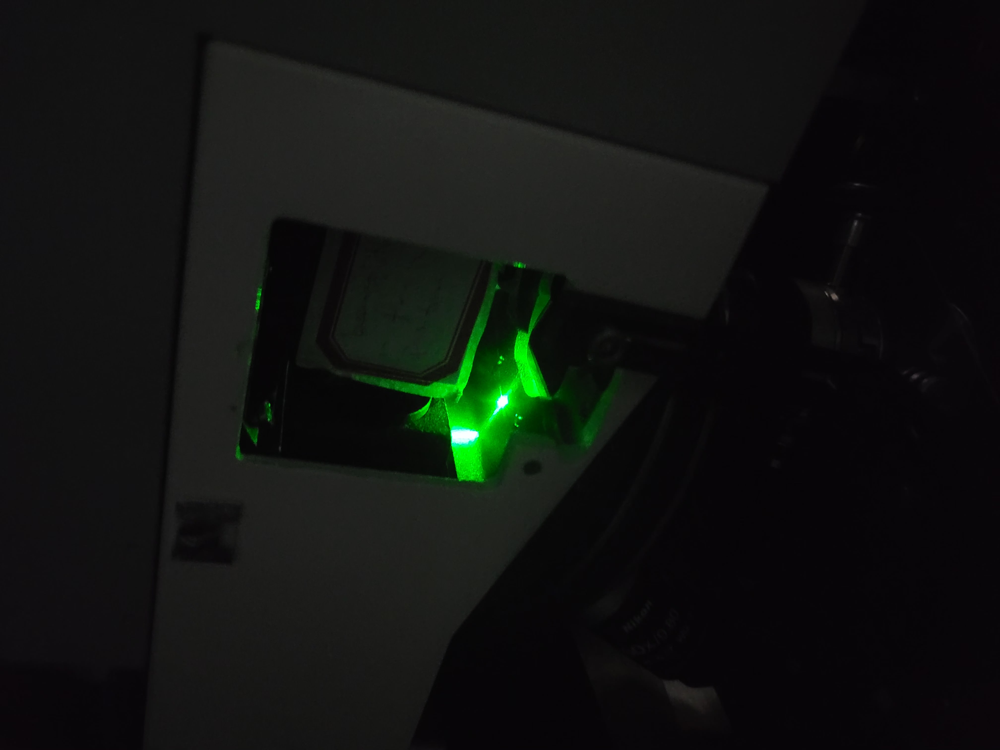

Testing\_photodetector\_2023-07-18

Tuesday, July 18, 2023

6:51 PM

Fabricated 2 aluminum setscrew mounts opposite existing knobs on SNOM objective to replace spring system. To translate in the x or y direction via the knobs, one knob must be twisted clockwise and its opposing knob must be twisted counterclockwise. \*Since there are fewer threads per inch on the new setscrews compared to the existing ones, the new setscrews must be screwed in and out at a slower rate while rotating their opposite setscrew to avoid compressing the stage.\*

 

Verdi power at fiber tip: ~4 mW, same as near-IR laser.

 

Green light not visible on CCD when coupled into SNOM tip input. No increase in T-B, L-R, or $\\sigma$ values.

-   Rotated endcap 180 degrees. Still no signal or spot on cantilever/screen.

    -   Re-coupled IR laser. Still no signal.

-   "Focus of the beam deflection laser can be seen 50 um above the pyramid" -- manual

-   Turning adjustment screw T-B makes no difference

 

Either the beam isn't reaching the objective due to a missing/poorly aligned mirror or the photodetector is not working.

-   Upon closer inspection, there seems to be a mirror system that is missing in the microscope that would direct the feedback laser to the cantilever (see below image)

 

